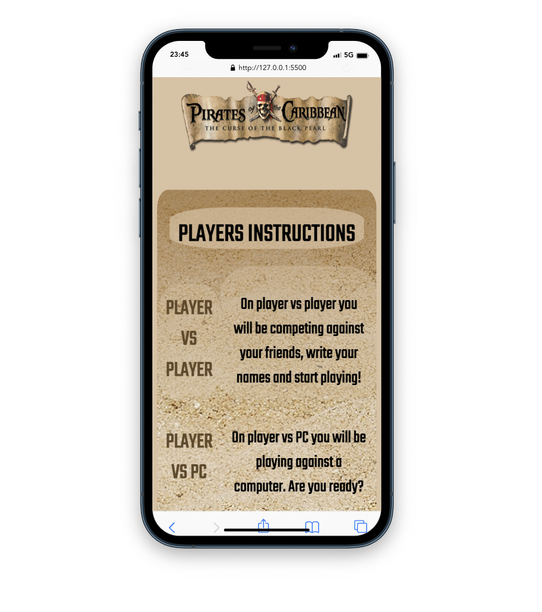
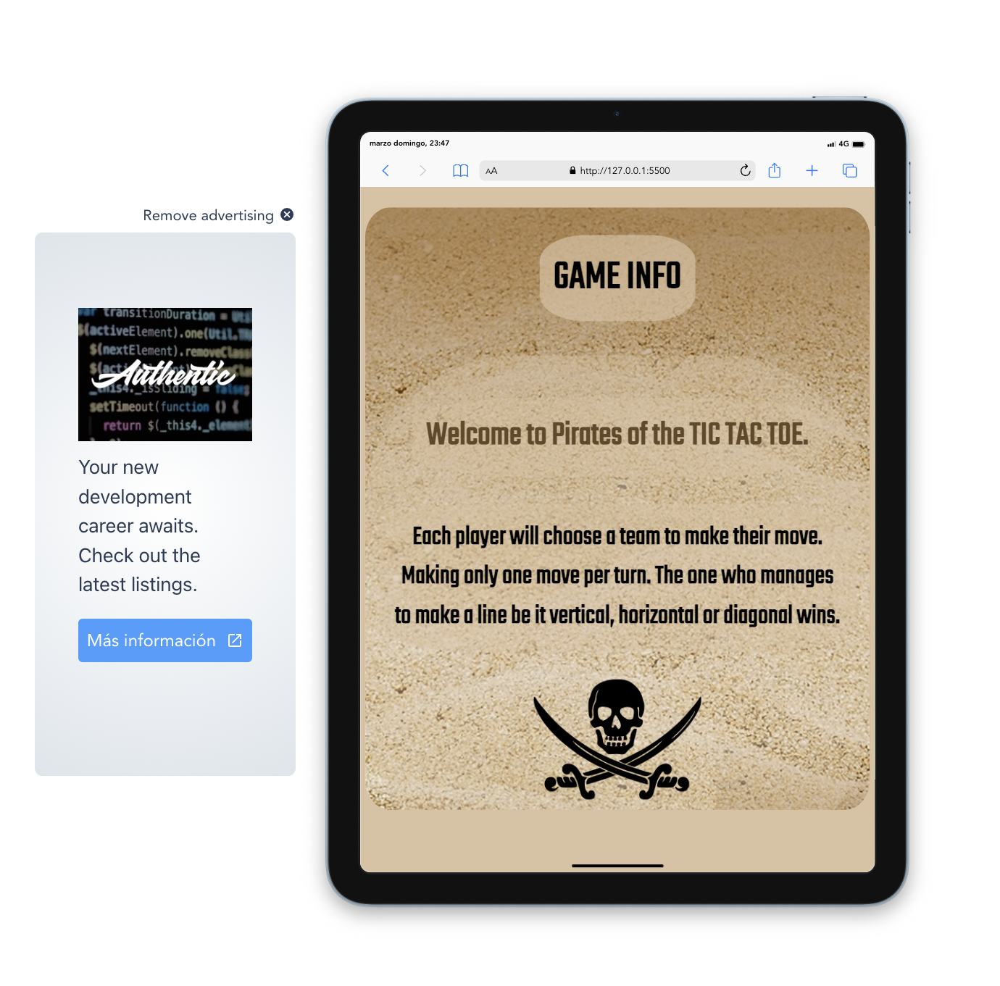

## My first projetc with JavaScript.

## Table of Contents

- [Introduction](#introduction)
- [Requirements & Usage](#requirements)
- [Built with](#builtwith)
- [Demo](#builtwith)
- [Screenshots](#screenshots)

## Introduction 

This is my first project using some JavaScript under the 'bootcamp'training of the Geekshubs Academy creating an adaptation of the classic game 'Tic Tac Toe'.

## Requirements & usage 

The only requirement is to have a code editor like "Visual Studio Code" for example.

To start playing the game you have to start reading the steps to follow on the main website. So read the playing rules, choose a player (you can play against a partner or against the pc) then click 'play' button and... good luck!

### Demo & screenshoots

To preview the demo <a href="https://leyreromero.github.io/gameboy-1/" > tap here </a>.

The screenshoots with and without pressing the bottom 'start'.

>
